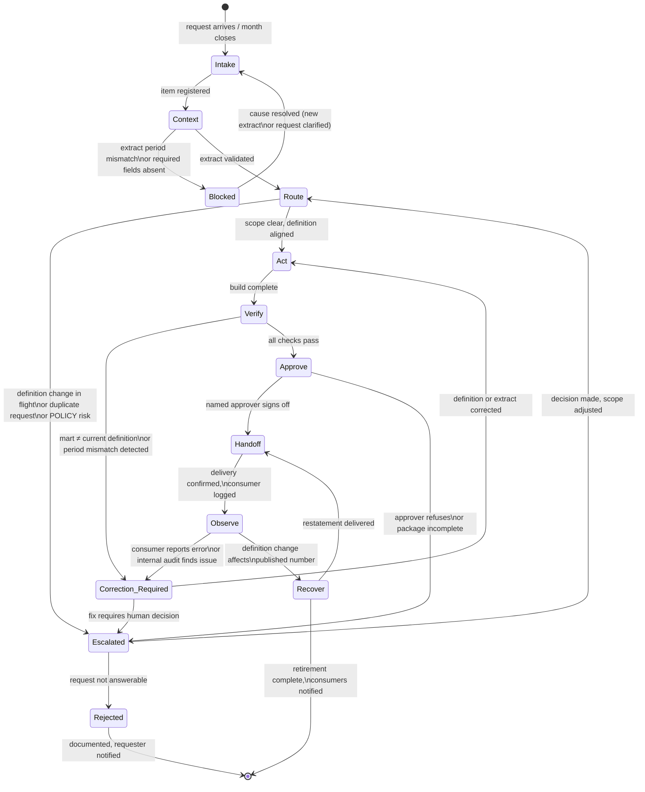

# Lifecycle worksheet

## Selected work item

| Campo | Valor |
| :- | :- |
| Track | DDLC |
| Process | The month's figures are produced |
| Trace principal | INCIDENT-03: the self-service number moved and nobody could say why |
| Held-out | REQUEST-007: self-service per account for the August packs |
| Intended outcome | Understand what must be established before a metric figure can be published and used by another team |
| Current owner | Analytics lead (UNKNOWN name) — source: `docs/incidents/INCIDENT-03.md` |

---

## Part 1 — Current process

Trace of INCIDENT-03 through the current process, step by step.
Every claim cites its source. Missing facts are UNKNOWN. Contradictions are registered, not resolved.

| # | Passo | O que foi decidido | Evidência usada | Quem decidiu | Fonte | Lacunas (UNKNOWN / CONTRADICTION) |
|---|-------|--------------------|-----------------|--------------|-------|-----------------------------------|
| 1 | Definition change reviewed and merged | `self_service_rate` v3 substitui v2 a partir de 2026-07-01; v3 exclui edições materiais e tickets reabertos em 48h | O texto da nova definição em `project/metrics/metric-definitions.yaml` | Sofia Marques (autora), Declan Byrne (reviewer) | `docs/pr-notes/0088-self-service-v3.md` | Nenhum consumidor da definição foi identificado antes da decisão; lista de consumidores não existe |
| 2 | Mart update deferred | Não atualizar `marts/self_service.sql` durante o período de junho para manter os meses comparáveis | UNKNOWN — não há registro de qual evidência baseou a decisão de diferir | UNKNOWN | `docs/pr-notes/0088-self-service-v3.md`: "noticed and left" | Nenhum follow-up agendado; nenhum ticket/issue criado para rastrear o pendente |
| 3 | No consumer notification sent | (Decisão implícita) prosseguir sem anunciar a mudança de definição | Nenhuma — não há lista de consumidores | UNKNOWN | `docs/incidents/INCIDENT-03.md`; `docs/pr-notes/0088-self-service-v3.md`: "Nobody was told" | POLICY-05 exige anúncio um período de reporte antes da mudança; não foi cumprida porque não há lista de a quem anunciar |
| 4 | July extract taken | Os CSVs do período de reporte de julho foram exportados do banco operacional | Manifest file (data e conteúdo do extract); colunas do CSV como verificação implícita de que a query está correta | UNKNOWN — pessoa do suporte (geralmente Joao, variou: 3 pessoas em 2 anos) | `docs/interviews/2026-08-12 Declan Byrne...`; `data/ops-extract/extract-manifest.yaml` (proxy de agosto) | Data exata do extract de julho: UNKNOWN; a query usada pelo executor pode estar desatualizada — Declan a mudou duas vezes sem confirmar se todos têm a versão atual |
| 5 | Build run for July | Os números estão prontos — todos os 6 testes de forma passaram | Saída dos 6 testes SQL (`project/tests/*.sql`): shape, range, integridade referencial | Declan Byrne (implicitamente, ao não sinalizar problema) | `docs/interviews/2026-08-12 Declan Byrne...`; `project/tests/*.sql` | Os testes não verificam: (a) se o mart implementa a definição vigente; (b) se o extract é do período correto; (c) se houve aprovação humana. CONTRADICTION confirmada (C6): `stg_suggestions.sql` computa `is_self_served = CAST(sent AS BOOLEAN)` (v2 puro); `suggestion.csv` não tem o campo `human_edit_material` exigido por v3 (colunas verificadas: `suggestion_id, ticket_id, created_at, article_ids, confidence, route, route_reason, sent`); v3 nunca pôde ser implementado com o extract atual. Todos os 6 testes de forma passam mesmo com o mart implementando uma definição supersedida. |
| 6 | Figures handed to Reporting | Figuras prontas para publicação | Testes de forma passando; nenhum artefato com versão da definição | Declan Byrne | `docs/interviews/2026-08-12 Declan Byrne...`; `docs/policies.md` (POLICY-13) | Nenhuma informação de versão acompanhou os números; POLICY-13 exige que figuras em packs nomeiem métrica e versão — não cumprida; artefato de entrega pode ter sido mensagem (sem persistência) |
| 7 | July service review packs published | Os números de self-service de julho estão corretos e prontos para o cliente | Nenhuma evidência documentada além dos números em si | Lucia Ferreira / Reporting (UNKNOWN o processo de aprovação de Reporting) | `docs/incidents/INCIDENT-03.md` | Nenhuma verificação de que a definição usada é a mesma que o cliente espera; POLICY-13 não cumprida (versão não declarada no pack) |
| 8 | Sunder Retail Supply questions the figure | (Não há decisão — é o cliente sinalizando problema) | Pack de julho vs. pack de junho com o mesmo cliente | Sunder Retail Supply (TICKET-004424) | `docs/incidents/INCIDENT-03.md` | Data exata da pergunta: UNKNOWN (incidente escrito em 2026-08-06) |
| 9 | Two-day investigation | Explicação dada ao cliente: a definição mudou de v2 para v3 em 2026-07-01 | Histórico de mudanças (PR notes) | Analytics lead (UNKNOWN nome) | `docs/incidents/INCIDENT-03.md` | CONTRADICTION (C6): a causa-raiz atribuída é estruturalmente impossível — o campo `human_edit_material` não existe no extract (`suggestion.csv`) e portanto v3 nunca pôde ser computado. A equipe passou dois dias investigando a hipótese errada. A razão real da mudança do número permanece UNKNOWN. |
| 10 | No systemic fix | Nada foi mudado | Nenhuma | UNKNOWN | `docs/incidents/INCIDENT-03.md`: "Nothing was changed" | ISSUE-30 ("No list of who consumes which metric") aberto em `data/tracker.csv` sem owner ativo; nenhum follow-up registrado no tracker para o incidente em si |

---

## Onde a informação se perdeu

Três pontos exatos de perda de informação no processo atual.

### Ponto 1 — Definição e código ficaram dessincronizados (Passos 1–2)

A definição v3 foi aprovada e declarada vigente (2026-07-01), mas o mart e o modelo de staging nunca foram atualizados. A intenção de atualizar o mart foi registrada apenas em texto na PR note, sem ticket, sem dono, sem data de follow-up. A informação de que o código está rodando uma definição diferente da declarada se perdeu imediatamente após o merge.

**O que isso significa:** toda figura de `self_service_rate` produzida desde 2026-07-01 está usando a lógica v2, enquanto `metric-definitions.yaml` (published 2026-08-20) declara v3 como vigente. Isso inclui os números entregues para REQUEST-004 (julho) e REQUEST-007 (agosto).

### Ponto 2 — A figura saiu sem versão (Passo 6)

O número entregue a Reporting não carregava a versão da definição com que foi calculado. Não há campo de versão em nenhum mart. Não há artefato obrigatório de entrega. Se a entrega foi por mensagem (possível conforme entrevista), não há nem o CSV.

**O que isso significa:** quando Sunder Retail Supply perguntou por que o número mudou, ninguém conseguiu responder por dois dias porque não havia registro de qual definição havia sido usada em cada pack.

### Ponto 3 — Não há lista de consumidores (Passo 3)

Quando a definição mudou, POLICY-05 exigia notificação um período antes. Isso é impossível sem saber quem consome cada métrica. A informação de "quem depende de qual versão" nunca foi registrada.

**O que isso significa:** três consumidores foram afetados sem aviso (service review packs, help portal, board slide de REQUEST-005 — conforme `docs/incidents/INCIDENT-03.md`). O portal ainda serve a métrica "sem fixar versão" (INCIDENT-03). ISSUE-30 existe no tracker mas não tem owner ativo.

---

## Custo observado

| Ponto de perda | Custo | Fonte |
|----------------|-------|-------|
| Ponto 1 (código ≠ definição) | Causa-raiz do incidente provavelmente mal diagnosticada; se o mart nunca foi atualizado para v3, o número não mudou pela razão declarada — o time passou dois dias investigando a causa errada | `docs/incidents/INCIDENT-03.md`, `project/models/staging/stg_suggestions.sql` |
| Ponto 2 (figura sem versão) | Dois dias para responder a uma pergunta de cliente; incapacidade de reconciliar packs históricos sem investigação manual | `docs/incidents/INCIDENT-03.md` |
| Ponto 3 (sem lista de consumidores) | Três consumidores impactados sem aviso; portal ainda serve métrica sem versão fixada; POLICY-05 estruturalmente impossível de cumprir | `docs/incidents/INCIDENT-03.md`, `docs/policies.md` |

---

## Part 2 — Proposed lifecycle

### 3a. Mapa dos 9 estágios

| Estágio | Nome na trilha | O que acontece | Evidência de saída | Owner |
|---------|---------------|----------------|-------------------|-------|
| Intake | **Request registered** | Pedido de número chega (de Reporting, Product ou Portal Engineering) OU mês fecha e o refresh é disparado. Item recebe REQUEST-NNN se ainda não tem. Solicitante e deadline são registrados. | `data/requests/inbox.csv` com linha preenchida (request_id, from_team, requester, received, needed_by, summary) | Declan Byrne |
| Context | **Extract validated** | Extract manual baixado da pasta compartilhada. Manifest verificado: `taken_at`, `taken_by`, `row_counts`, período coberto. Colunas do extract comparadas com os campos exigidos pela definição vigente da métrica solicitada. Versão da definição confirmada com o solicitante se não especificada no request. | `data/ops-extract/extract-manifest.yaml` lido + checklist de campos preenchido (existe ou não `human_edit_material`, etc.) | Declan Byrne |
| Route | **Work scoped** | Determinar: (a) métrica nova ou existente? (b) o mart implementa a definição vigente? (c) há mudança de definição em curso? (d) consumidores precisam ser notificados (POLICY-05)? (e) POLICY-06 exige approver nomeado para operações destrutivas? Ações que o agente decide sozinho vs. o que requer humano são declaradas aqui. | Decisão registrada: path escolhido (happy path / escalação / bloqueio) + justificativa com fonte | Declan Byrne (decisões de escopo) / Analytics lead (definição nova ou mudança) |
| Act | **Models built** | `project/run.py` executado. Staging + marts construídos. Versão da definição implementada em cada mart registrada explicitamente no artefato de build. | Log de build com: timestamp, versão do extract, lista de modelos executados, versão da definição implementada por cada mart | Declan Byrne (execução automatizada) |
| Verify | **Shape and definition checked** | Seis testes de forma existentes executados. ADICIONALMENTE: (1) verificar se o mart implementa a definição vigente (campo a campo, não só por nome); (2) verificar se o período do extract coincide com o período de reporte; (3) verificar se todos os campos exigidos pela definição vigente existem no extract. | Saída dos testes (zero rows = pass) + relatório de verificação de definição: definição implementada vs. vigente, período do extract vs. período solicitado | Declan Byrne |
| Approve | **Number confirmed correct** | Humano nomeado revisa: o número está correto (não só válido)? O pacote de decisão contém: número + nome da métrica + versão + período + data do extract + log de build + resultado dos testes. Approver assina o registro. A skill prepara o pacote; a aprovação é ato humano. | Registro de aprovação com: nome do approver, data, métrica, versão, período, extract date, decisão explícita ("correto" ou "bloqueado") | Analytics lead ou approver nomeado por POLICY-06 |
| Handoff | **Number delivered with provenance** | Número entregue sempre como artefato (CSV ou arquivo estruturado), nunca por mensagem. Artefato inclui: número, nome da métrica, versão, período, data do extract, nome do approver. Consumidor registrado em log de consumidores (item de rastreabilidade para POLICY-05). | CSV de entrega com campos de proveniência + entrada no log de consumidores (`docs/consumer-log.md` ou equivalente): quem, quando, qual versão, para qual uso | Declan Byrne (entrega) / Lucia Ferreira ou outro consumidor (recebimento confirmado) |
| Observe | **Consumer and citation tracked** | Após entrega: onde o número foi usado (pack, slide, dashboard, board)? Por quem? Em qual versão? Registro permite notificar consumidores afetados se a definição mudar (cumprir POLICY-05) ou se o número precisar de restatement. | Entrada no log de consumidores com: citation_id, consumer, context (ex.: "service review pack agosto 2026"), metric, version, period | Analytics lead |
| Recover | **Rebuild, restatement, or retirement** | Acionado quando número incorreto é detectado ou definição muda afetando publicações existentes. Três caminhos: (1) Rebuild — novo build com dados ou definição corretos; (2) Restatement — número corrigido entregue aos consumidores listados no log do Observe; (3) Retirement — número retirado de circulação com notificação. Consumidores do Observe são notificados em todos os caminhos. | Registro de recover: tipo (rebuild/restatement/retirement), causa, consumidores notificados (com confirmação), novo número ou retirada formal | Analytics lead |

---

### 3b. Estados fora do caminho feliz

| Estado | O que leva até ele | De quais estágios pode ser alcançado | Como sai |
|--------|--------------------|--------------------------------------|----------|
| **Blocked** | Extract do período errado; campos necessários para a definição vigente ausentes no extract; request sem especificação suficiente para responder | Context, Route | Bloqueio documentado → solicitante notificado → item volta a Intake quando a causa é resolvida (novo extract ou request esclarecido) |
| **Escalated** | Mudança de definição detectada durante período aberto; POLICY-05/06/13 em risco; dois requests possivelmente duplicados não resolvidos (ex.: REQUEST-007 e REQUEST-011) | Route, Approve | Analytics lead ou Sofia Marques revisa → decide retornar ao Route com escopo ajustado, ou rejeitar, ou avançar com aprovação explícita do risco |
| **Rejected** | Request não especificável (definição de métrica ausente); duplicata confirmada já respondida; dados insuficientes e extract não pode ser refeito | Route (após escalação) | Justificativa registrada em `inbox.csv` (status = rejected, notes = motivo) → solicitante notificado |
| **Correction required** | Número publicado está errado (detectado por cliente, por comparação de períodos, ou por auditoria interna) | Observe (detecção pós-handoff), ou Verify (detecção antes) | Abre item de Recover para o item em questão; número publicado marcado como "under review" nos logs de consumidores até restatement ser entregue |
| **Retired** | Definição de métrica descontinuada; número não pode ser reconciliado; dado de origem comprometido | Recover | Notificação formal a todos os consumidores do log do Observe; item encerrado com status = retired e data da retirada |

Os incidentes do repositório mapeiam assim:
- **INCIDENT-03** → deveria ter acionado **Correction required** → **Recover (Restatement)** após a detecção pelo cliente. No processo atual, não há esses estados — o processo simplesmente "explicou" sem corrigir.
- **INCIDENT-01 e INCIDENT-02** → fora do escopo do processo Analytics (são do processo de suporte/portal), mas ilustram o mesmo padrão: **Correction required** sem **Recover** estruturado.

---

### 3c. Diagrama de transições

---

### 3d. Dois estados completos: Verify e Approve

#### Verify — Shape and definition checked

| Campo | Valor |
|-------|-------|
| **Entry condition** | Build completo (run.py executado sem erro); log de build disponível com lista de modelos executados e versão da definição declarada por cada mart |
| **Required evidence** | (1) Saída dos 6 testes de forma (`project/tests/*.sql`) — zero rows em cada; (2) relatório de verificação de definição: campo a campo, a implementação do mart vs. a definição vigente em `metric-definitions.yaml`; (3) comparação explícita entre `extract-manifest.yaml:taken_at` / cobertura declarada e o período de reporte solicitado; (4) checklist de campos do extract: para cada campo exigido pela definição vigente (ex.: `human_edit_material` para `self_service_rate` v3), confirmar presença ou ausência em `data/ops-extract/suggestion.csv` |
| **Exit condition** | Todos os 4 itens de evidência presentes e sem divergências; OU divergências documentadas e escaladas com evidência |
| **Owner** | Declan Byrne |
| **Allowed transitions** | → **Approve** (todos os checks passam); → **Correction required** (mart implementa definição errada, período errado, ou campo ausente no extract); → **Escalated** (divergência requer decisão humana antes de corrigir) |
| **Failure path** | Se o mart implementa definição diferente da vigente: registrar qual versão está implementada, qual é a vigente, qual campo diverge → **Correction required**. Se campo exigido pela definição não existe no extract: registrar campo ausente → **Blocked** (o problema está a montante, no extract, não no build). A skill recusa avançar para Approve se qualquer item de evidência estiver ausente ou com divergência não escalada. |

**Por que Verify é o estágio crítico:** INCIDENT-03 mostra que os 6 testes de forma passaram enquanto o mart implementava uma definição supersedida e os dados necessários para a definição vigente nem existiam no extract. O Verify do ciclo proposto teria bloqueado neste ponto — evidência (2) e (4) acima teriam falhado — e o item nunca chegaria ao Approve.

---

#### Approve — Number confirmed correct

| Campo | Valor |
|-------|-------|
| **Entry condition** | Pacote de decisão completo: número + nome da métrica + versão implementada + período + data do extract + log de build + saída dos testes + relatório de verificação de definição (do Verify) |
| **Required evidence** | Pacote de decisão conforme acima; registro assinado pelo approver com: nome, data, decisão explícita ("correto" ou "bloqueado com motivo"); para operações que envolvam destruição de mart: approver nomeado conforme POLICY-06 |
| **Exit condition** | Approver nomeia a aprovação com todos os campos do pacote preenchidos e assina o registro; OU approver rejeita e documenta o motivo |
| **Owner** | Analytics lead (Sofia Marques ou substituto nomeado); para operações destrutivas: approver nomeado conforme POLICY-06 |
| **Allowed transitions** | → **Handoff** (aprovação registrada); → **Escalated** (approver recusa ou pede mais evidência); → **Correction required** (approver identifica erro no número) |
| **Failure path** | Se o pacote de decisão não inclui versão da definição implementada: a skill recusa preparar o pacote e retorna ao Verify. Se o approver não estiver disponível dentro do deadline: registrar como **Escalated** com o deadline e escalar para Analytics lead. Se os testes de forma passaram mas o approver identifica que o número está errado: registrar como **Correction required** com evidência do erro — esta é a distinção "válido × correto" que INCIDENT-03 exemplifica. |

**Regra inviolável do Approve:** a skill prepara o pacote de decisão e propõe o próximo estado. A aprovação — o registro assinado com nome e data — é sempre ato de uma pessoa nomeada. A skill nunca registra uma aprovação que não aconteceu.

---

### 3e. Premissas e limitações do modelo

**Premissas:**

1. **Extract tem manifest.** O ciclo assume que `data/ops-extract/extract-manifest.yaml` existe e é preenchido por quem faz o extract. Se o manifest estiver ausente, o estágio Context bloqueia imediatamente.

2. **`metric-definitions.yaml` é a fonte de verdade para versões.** O ciclo assume que a definição vigente está em `project/metrics/metric-definitions.yaml` e que ela é mantida atualizada. Se definição e arquivo divergirem, o ciclo não tem como detectar.

3. **Um log de consumidores existe ou será criado.** O ciclo depende de um artefato de rastreabilidade (log de consumidores) que hoje não existe no repositório. O Handoff cria a primeira entrada; o Observe mantém. Sem esse artefato, POLICY-05 permanece impossível de cumprir.

4. **O extract inclui os campos necessários para a definição vigente.** O ciclo depende de que o banco operacional exporte `human_edit_material` (e qualquer outro campo exigido pelas definições futuras) antes que o Verify possa passar para o Approve com a definição v3 de `self_service_rate`. Hoje esse campo não existe no extract — o ciclo bloquearia em Context/Verify para qualquer request de `self_service_rate` v3 até o extract ser corrigido.

5. **Existe um approver disponível antes do deadline.** Se o Analytics lead estiver ausente, o ciclo não tem um substituto nomeado. Isso é um risco aberto (ver Limitações).

**Limitações:**

| Limitação | Consequência | Observação |
|-----------|-------------|------------|
| O ciclo não verifica se a query de extração usada pelo suporte é a versão atual | Extract com colunas erradas passaria pelo Context se o manifest tiver os row_counts corretos | A verificação de colunas no Context mitiga parcialmente, mas não verifica a query em si |
| `suggestion_acceptance_rate` v1 não tem mart correspondente | Qualquer request para essa métrica ficaria preso em Route (sem implementação) | Lacuna registrada nos findings; requereria Act antes de poder continuar |
| O log de consumidores não existe hoje | O ciclo propõe criá-lo, mas a primeira iteração real precisará de um processo de retroativamente registrar consumidores conhecidos | Sunder Retail Supply, help portal e REQUEST-005 são os três consumidores identificados retroativamente por INCIDENT-03 |
| A causa real da mudança do número de Sunder Retail Supply (INCIDENT-03) permanece UNKNOWN | O ciclo proposto teria bloqueado antes de publicar, mas não resolve o mistério da causa original | O dado necessário para investigar (`human_edit_material`) não existe no extract atual |
| O ciclo é descritivo (Módulo 1) — não há execução automatizada, hooks ou state engine | Cada transição depende de disciplina manual | O ciclo fornece a linguagem e os artefatos; o enforcement começa no Módulo 2 |

---

## Human judgment boundaries

| Decisão | Por que não é mecânica | Dono da decisão | Evidência preparada por uma skill |
|---------|----------------------|-----------------|----------------------------------|
| O número está correto (não só válido) | Testes de forma passam mesmo com definição errada (INCIDENT-03). Nenhum teste verifica se o número reflete o comportamento real da conta. | Analytics lead (Approve) | Pacote de decisão do Approve: número + versão + período + extract date + log de testes + relatório de verificação de definição |
| Mudança de definição é segura durante período aberto | Depende de quem está consumindo, se os packs do período já foram publicados, e do risco de incomparabilidade entre períodos. Regras não capturam todos os cenários. | Analytics lead + Sofia Marques (Route/Escalated) | Lista de consumidores do Observe + período de publicações em aberto |
| Dois requests são duplicatas | Requer contato com os dois solicitantes para confirmar se querem o mesmo número. A semântica ("automation rate" vs. "self-service") é julgamento humano. | Declan Byrne + solicitantes (Route) | Textos de REQUEST-007 e REQUEST-011 lado a lado; confirmação escrita dos solicitantes |
| Approver para operação destrutiva | POLICY-06 exige approver nomeado. Quem tem autoridade depende do impacto — não é uma regra computável. | Analytics lead ou quem POLICY-06 designar (Approve) | `rebuild.py` alerta da necessidade; skill recusa avançar sem registro de aprovação |

---

## Failure and recovery

| Estado de falha | Sinal de detecção | Caminho de recuperação | Limite de retry | Dono da escalação |
|----------------|-------------------|----------------------|-----------------|-------------------|
| **Blocked** (extract errado) | Context: `taken_at` fora do período ou campos ausentes | Novo extract solicitado ao suporte; item retorna a Intake | 1 retry — se o segundo extract também falhar, escalar | Declan Byrne |
| **Blocked** (request incompleto) | Route: métrica sem definição em `metric-definitions.yaml` ou request ambíguo | Solicitante contatado para esclarecimento; item aguarda | Sem retry automático — depende do solicitante | Declan Byrne → solicitante |
| **Correction required** (pré-handoff) | Verify: mart implementa definição errada; Approve: approver recusa | Corrigir implementação → retornar ao Act → Verify | 1 retry; se exigir mudança de definição, escalar | Declan Byrne |
| **Correction required** (pós-handoff) | Observe: consumidor reporta erro ou auditoria interna detecta | Abrir item de Recover; marcar entrega como "under review" no log | Sem retry — abre Restatement | Analytics lead |
| **Escalated** | Route ou Approve: risco de POLICY, duplicata, mudança de definição | Analytics lead revisa e decide: retornar ao Route, rejeitar, ou aprovar o risco explicitamente | Sem limite — depende da decisão humana | Analytics lead (Sofia Marques) |

---

## Terminal states

| Estado | Resultado de negócio representado | Evidência final exigida |
|--------|----------------------------------|------------------------|
| **Done** | Número correto entregue, consumidor registrado, aprovação documentada | Registro de aprovação + CSV de entrega com proveniência + entrada no log de consumidores |
| **Rejected** | Request não respondível (métrica indefinida, dados insuficientes, duplicata confirmada) | Entrada em `inbox.csv` com status = rejected + motivo + notificação ao solicitante |
| **Retired** | Número retirado após erro irrecuperável ou descontinuação de definição | Notificação formal a todos os consumidores do log do Observe + registro de retirada com data e motivo |

---

## Open questions

- CONTRADICTION confirmada (C6): `docs/incidents/INCIDENT-03.md` atribui a mudança do número à transição v2→v3. Investigação na Fase 2 confirma que isso é estruturalmente impossível: o campo `human_edit_material` (necessário para v3) não existe em `data/ops-extract/suggestion.csv` (colunas verificadas: `suggestion_id, ticket_id, created_at, article_ids, confidence, route, route_reason, sent`) nem em `stg_suggestions.sql`. V3 nunca pôde ser implementado com o extract atual. A causa real da mudança do número de Sunder Retail Supply permanece UNKNOWN — a equipe investigou durante dois dias uma hipótese que o pipeline não tem condições de produzir. Possíveis causas não investigadas: mudança de comportamento real da conta, problema de qualidade de dados no extract, ou mudança na lógica do help portal (serviço separado, `stg_suggestions.sql` lê de `ops.suggestion`).
- UNKNOWN: quais outros packs ou consumidores foram afetados pela dessincronização código/definição além dos três citados em INCIDENT-03?
- UNKNOWN: o data-dictionary.xlsx está alinhado com os modelos atuais? (arquivo binário, não lido)
